# **network-programming-group6**

## ***`Chủ đề: Ứng dụng truyền dữ liệu các thiết bị IOT bằng giao thức AMQP`***

## **Danh sách thành viên**

- Đỗ Anh Tú(nhóm trưởng)
- Hồ Thanh Huyền
- Vũ Viết Thành
- Nguyễn Tuấn Hiệp
- Phan Duy Thắng

| Thành viên  | Công việc  | Đánh giá |
| :------------ |:---------------:| -----:|
| Đỗ Anh Tú     | Làm phần backend(1,2,3,4,5), làm báo cáo | 22% |
| Hồ Thanh Huyền     | Làm backend(2), làm báo cáo        |   19,5% |
| Vũ Viết Thành | Làm backend(1), Làm frontend(1,2,3)        |    21% |
| Phan Duy Thắng | Làm backend(1,5)        |    19,5% |
| Nguyễn Tuấn Hiệp | Viết báo cáo, làm frontend(2)       |    18% |


## **Tổng quan về giao thức AMQP**

### Giới thiệu về Rabbit AMQP

RabbitMQ là một hệ thống phần mềm mã nguồn mở cung cấp một giao thức trung gian tin nhắn phân tán gọi là Advanced Message Queuing Protocol (AMQP). AMQP là một giao thức chuẩn để giao tiếp giữa các hệ thống phân tán và cung cấp tính năng như đảm bảo tin nhắn đến, xác nhận gửi và giao nhận tin nhắn theo thứ tự. RabbitMQ, như một trình triển khai AMQP phổ biến, cung cấp khả năng xử lý hàng triệu tin nhắn một cách tin cậy và hiệu quả. Nó được thiết kế để hỗ trợ gửi và nhận các tin nhắn giữa các ứng dụng, các dịch vụ và các thành phần trong một hệ thống phân tán.

RabbitMQ sử dụng mô hình hàng đợi (queue) để lưu trữ tin nhắn trong quá trình gửi và nhận. Các ứng dụng có thể gửi tin nhắn đến một hàng đợi và các ứng dụng khác có thể lấy tin nhắn từ hàng đợi đó để xử lý. Điều này cho phép các ứng dụng hoạt động độc lập và tách biệt với nhau, giúp tăng tính mở rộng và linh hoạt trong hệ thống phân tán.

RabbitMQ là một giao thức có thể lập trình. Nó hỗ trợ nhiều ngôn ngữ lập trình và cung cấp các thư viện và SDK cho Java, Python, .NET, Ruby và nhiều ngôn ngữ khác. Điều này cho phép các nhà phát triển sử dụng RabbitMQ trong các ứng dụng của họ một cách dễ dàng và linh hoạt. Tuy nhiên, nó cũng đòi hỏi các lập trình viên phải xác định được xung đột định nghĩa tiềm tàng.

RabbitMQ và giao thức AMQP đem lại nhiều lợi ích quan trọng cho việc xây dựng và triển khai các hệ thống phân tán:

- Đảm bảo độ tin cậy: RabbitMQ sử dụng giao thức AMQP để đảm bảo rằng tin nhắn được gửi và nhận một cách đáng tin cậy. Nó hỗ trợ xác nhận gửi và giao nhận tin nhắn, đảm bảo rằng không có tin nhắn nào bị mất trong quá trình truyền và đảm bảo các tin nhắn đến đúng thứ tự.

- Tính mở rộng và linh hoạt: RabbitMQ cho phép xây dựng các hệ thống phân tán có tính mở rộng cao và linh hoạt. Bằng cách sử dụng mô hình hàng đợi, các ứng dụng có thể gửi và nhận tin nhắn một cách không đồng bộ và độc lập. Điều này cho phép các thành phần trong hệ thống hoạt động độc lập và có thể được mở rộng dễ dàng khi cần thiết.

- Kiến trúc phân tán: RabbitMQ hỗ trợ kiến trúc phân tán, cho phép triển khai các mô hình phân tán phức tạp. Với RabbitMQ, bạn có thể xây dựng các mạng lưới hàng đợi và các kịch bản giao tiếp phức tạp giữa các ứng dụng và dịch vụ khác nhau.
Điều tiết tải: RabbitMQ có thể được sử dụng để điều tiết tải trong các hệ thống có tải công việc cao. Bằng cách sử dụng hàng đợi, nó cho phép phân phối công việc một cách công bằng và kiểm soát tốc độ xử lý của các ứng dụng tiêu thụ tin nhắn.

- Tích hợp dễ dàng: RabbitMQ cung cấp các thư viện và SDK cho nhiều ngôn ngữ lập trình phổ biến, cho phép tích hợp dễ dàng vào các ứng dụng hiện có. Bạn có thể sử dụng RabbitMQ trong các ứng dụng Java, Python, .NET, Ruby và nhiều ngôn ngữ khác.
Hỗ trợ nhiều tính năng: RabbitMQ cung cấp nhiều tính năng hữu ích như xử lý hàng triệu tin nhắn, định tuyến linh hoạt, xử lý lỗi và sự kiện, điều khiển quyền truy cập,...

## **Kiến trúc project**

### Mô hình kiến trúc dịch vụ

<div align="center">
        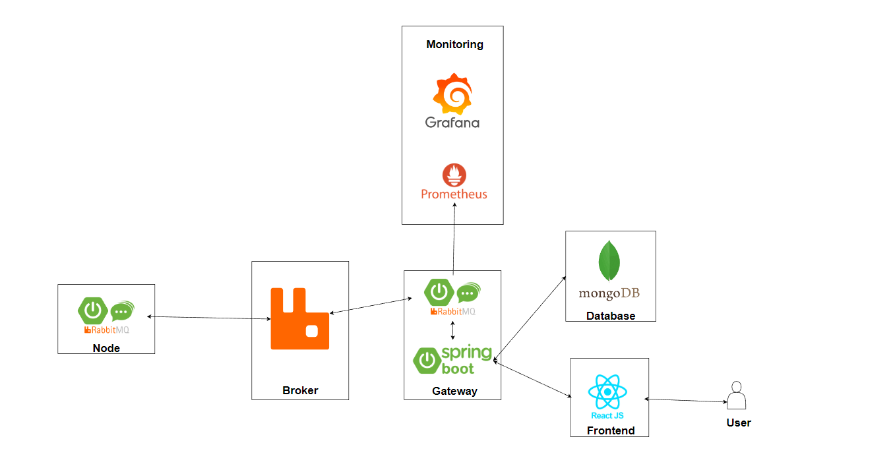
</div>

### Công nghệ sử dụng trong project

- **`RabbitMQ`**: Dựng broker
- **`Spring AMQP`**: Framework phục vụ để code node và gateway bằng giao thức AMQP
- **`Spring boot`**: Sử dụng làm backend cho project
- **`Reactjs`**: Sử dụng làm frontend cho project
- **`Mongodb`**: Sử dụng làm database
- **`Prometheus`**: Thu thập metric từ rabbit và các node container để giám sát
- **`Grafana`**: Mô hình hóa các thông số từ rabbit và node phục vụ cho việc giám sát(cụ thể là mục 4 và 5)
- **`Docker`**: Chạy project dưới dạng container

File docker compose để thực thi chương trình

```yml
version: '3'

# https://docs.docker.com/compose/compose-file/#networks
networks:
  rabbitmq-prometheus:

# https://docs.docker.com/compose/compose-file/#volumes
volumes:
  rabbitmq-prometheus_prometheus:
  rabbitmq-prometheus_grafana:
services:

  mongo:
    image: mongo:6.0
    restart: always
    ports:
      - 27017:27017
    environment:
      MONGO_INITDB_ROOT_USERNAME: admin
      MONGO_INITDB_ROOT_PASSWORD: pass
      MONGO_INITDB_DATABASE: iot_data

    volumes:
      - ./mongo-entrypoint/:/docker-entrypoint-initdb.d/
    
    command: mongod
  rabbitmq:
    build: ./AMQP-broker
    ports:
      - 15671:15671
      - 15672:15672
      - 15692:15692
      - 25672:25672
      - 5672:5672
    networks:
      - "rabbitmq-prometheus"
  
  reactjs:
    build: ./frontend
    ports:
      - 3006:3000
  
  grafana:
    # https://hub.docker.com/r/grafana/grafana/tags
    image: grafana/grafana:8.3.4
    ports:
      - "3000:3000"
    networks:
      - "rabbitmq-prometheus"
    volumes:
      - rabbitmq-prometheus_grafana:/var/lib/grafana
      - ./grafana/dashboards.yml:/etc/grafana/provisioning/dashboards/rabbitmq.yaml
      - ./grafana/datasources.yml:/etc/grafana/provisioning/datasources/prometheus.yaml
      - ./grafana/dashboards:/dashboards
    environment:
      # https://grafana.com/plugins/flant-statusmap-panel
      # https://grafana.com/plugins/grafana-piechart-panel
      # https://grafana.com/plugins/grafana-polystat-panel
      # https://grafana.com/plugins/jdbranham-diagram-panel
      # https://grafana.com/plugins/michaeldmoore-multistat-panel
      # https://grafana.com/plugins/vonage-status-panel
      # https://grafana.com/plugins/yesoreyeram-boomtable-panel
      GF_INSTALL_PLUGINS: "flant-statusmap-panel,grafana-piechart-panel"
  prometheus:
    # https://hub.docker.com/r/prom/prometheus/tags
    image: prom/prometheus:v2.28.1
    networks:
      - "rabbitmq-prometheus"
    ports:
      - "9090:9090"
    volumes:
      - rabbitmq-prometheus_prometheus:/prometheus
      - ./prometheus.yml:/etc/prometheus/prometheus.yml:ro
  node-exporter:
    command:
      - '--path.procfs=/host/proc'
      - '--path.rootfs=/rootfs'
      - '--path.sysfs=/host/sys'
      - '--collector.filesystem.ignored-mount-points=^/(sys|proc|dev|host|etc)($$|/)'
    expose:
      - 9100
    # https://hub.docker.com/r/prom/node-exporter/tags
    image: prom/node-exporter:v1.2.0
    networks:
      - "rabbitmq-prometheus"
    volumes:
      - /proc:/host/proc:ro
      - /sys:/host/sys:ro
      - /:/rootfs:ro

```

## **Đặc tả chương trình**

**Các bước chạy chương trình**

Bước 1

```bash
~/project/network-programming-group6$ docker compose up
```

Bước 2

Do chúng em chưa kịp build thành file jar nên chạy project tại 2 tab AMQP-node và AMQP-gateway từ intellij

### **`Chương trình hiển thị thông tin các cảm biến thực hiện kết nối với gateway`**

**1. Backend:**

- Tất cả các censor được lưu vào trong database có dạng mẫu như sau:

```json
iot_plug_censor = {
    "id": "10",
    "name": 10,
    "status": "on",
    "have_turn_on": "no"
}
```

- Khi đó để hiển thị thông tin các cảm biến thực hiện kết nối với gateway ở bên gateway chỉ cần có chương trình xuất thông tin censor từ database lên.

```java
    @GetMapping("/censor")
    public ResponseEntity findAllCensors() {
        return new ResponseEntity(censorRepository.findAll(), HttpStatus.OK);
    }
```

- Kết quả:
    <div align="center">
        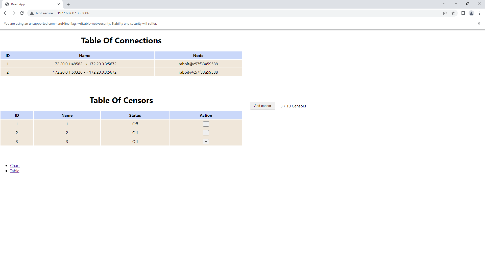
    </div>

### `Chương trình sinh dữ liệu cho các cảm biến: tự động sinh dữ liệu cảm biến và gửi dữ liệu lên gateway. Chương trình hiển thị dữ liệu nhận được phía gateway (sử dụng các biểu đồ line chart, bar chart, pie chart để hiển thị)`

1. Mô tả database

- Bộ dữ liệu trong DEBS 2014 Grand Challenge bao gồm thông tin về các sự kiện và hoạt động diễn ra trong các ngôi nhà thông minh. Cụ thể, dữ liệu bao gồm các bộ dữ liệu được ghi lại từ các cảm biến trong nhà (các phích cắm thông minh), thu thập thông tin về nhiệt độ, ánh sáng, độ ẩm, điện năng tiêu thụ và các hoạt động của cư dân. Tuy nhiên, tập dữ liệu được thu thập từ môi trường thực tế, do đó, khả năng dữ liệu không đúng định dạng cũng như thiếu các phép đo.

- Mục đích của việc cung cấp dữ liệu này là để thúc đẩy sự phát triển và thử nghiệm các giải pháp xử lý dữ liệu thời gian thực bằng cách giả định cấu trúc phân cấp với một ngôi nhà thông minh. Lược đồ của luồng cơ sở được mô tả như sau:
  - id: mã định danh duy nhất của phép đo [32 bit unsigned int].
  - timestamp: dấu thời gian của phép đo (số giây kể từ ngày 1 tháng 1 năm 1970, 00:00:00 GMT) [32 bit unsigned int].
  - value: phép đo [32 bit floating point].
  - property: loại phép đo: 0 cho công việc hoặc 1 cho tải [boolean].
  - plug_id: mã định danh duy nhất (trong một hộ gia đình) của phích cắm thông minh [32 bit unsigned int].
  - household_id: mã định danh duy nhất của hộ gia đình nơi đặt phích cắm [32 bit unsigned int].
  - house_id: mã định danh duy nhất của ngôi nhà nơi có hộ gia đình có phích cắm [32 bit unsigned int].

- Dữ liệu mẫu khi được lưu vào database

```json
iot_data = {
    "id": 23711,
    "unixTime": 937597,
    "value": 80.1,
    "workLoad": 0,
    "plugId": 1,
    "houseHoldId": 1,
    "houseId": 0

}
```

- Do vấn đề về thời gian code project nên chúng em chỉ giới hạn data ở đây là 1 nhà trong 1 tòa nhà và các censor là các plug_id. Khi đó dữ liệu chính sẽ là lượng điện tổng mà 1 censor tại 1 ổ cắm đo được với đơn vị là wat. Vì vậy `plugId` sẽ có giá trị mặc định là 1(lượng điện tiêu thụ từ lúc cắm điện tới lúc gửi), `houseHoldId` có giá trị mặc định là 1(ngôi nhà số 1), `houseId` có giá trị mặc định là 0(tòa nhà số 0).

2. Chương trình sinh dữ liệu từ phía Node

 ```java
    public void processData(RabbitTemplate iotData, int plugId) throws IOException, InterruptedException {
        String csvFilePath = "/home/mr8/project/network-programming-group6/AMQP-node/src/main/resources/debs40houses16h/house-0.csv";
        CSVReader reader = new CSVReader(new FileReader(csvFilePath));

        String[] nextLine;
        while ((nextLine = reader.readNext()) != null) {

            if ((Integer.parseInt(nextLine[5]) == 1) && (Integer.parseInt(nextLine[4]) == plugId) && (Integer.parseInt(nextLine[3]) == 1)&&(Double.parseDouble(nextLine[2])!=0)) {
                int id = Integer.parseInt(nextLine[0]);
                long unixTime = Long.parseLong(nextLine[1]);
                double watValue = Double.parseDouble(nextLine[2]);
                int workLoad = Integer.parseInt(nextLine[3]);
                int houseHoldId = Integer.parseInt(nextLine[5]);
                int houseId = Integer.parseInt(nextLine[6]);

                String msg = String.format("{\"id\": %d, \"unixTime\": %d, \"watValue\": %.3f, \"workLoad\": %d, \"plugId\": %d, \"houseHoldId\": %d, \"houseId\": %d}",
                        id, unixTime, watValue, workLoad, plugId, houseHoldId, houseId);

                String routingKey = getRoutingKeyByPlugId(plugId);
                iotData.convertAndSend("IOT_data", routingKey, msg);
                System.out.println(msg);
                Thread.sleep(250);
            }

        }
    }

}
 ```

- Đầu tiên chúng em chỉ định đường dẫn là 1 file dữ liệu từ tòa nhà số 0.
- Dữ liệu sẽ được lọc theo plugId được chỉ định từ bên gateway.
- File sẽ được gửi dưới định dạng json string để tiện cho bên gateway thu thập dữ liệu.
- Delay được chỉ đi khi đọc dữ liệu từ 1 dòng csv là 0.25s khác với thực tế là 2-3s sẽ gửi 1 lần dữ liệu thì chúng em để 0.25s là để cho ta có thể theo dõi dữ liệu nhanh hơn.
- Khi gửi dữ liệu thì msg sẽ được gửi với exchange là `IOT_data` và routingkey phù hợp với plugId. Ví dụ plugId = 2 thì routingkey sẽ là `IOTQueue2`. Lý do là bởi việc chỉ định riêng routingkey cho từng msg của plugId khi gửi lên trên broker thì cũng sẽ chỉ định riêng queue cho từng plug id, với routingkey `IOTQueue2` thì queue trên broker sẽ là `IOTQueue2` như vậy sẽ giảm tải cho queue, thay vì gửi hết data vào 1 queue thì data của riêng từng loại sẽ được gửi vào queue riêng biệt. Việc này giúp chương trình gửi dữ liệu sang bên gateway ít khi xuất hiện độ trễ, thuận tiện cho việc data realtime.

- Hàm chọn routingkey theo plugid từ gateway:

```java
private String getRoutingKeyByPlugId(int plugId) {
        switch (plugId) {
            case 1:
                return "IOTQueue";
            case 2:
                return "IOTQueue2";
            case 3:
                return "IOTQueue3";
            case 4:
                return "IOTQueue4";
            case 5:
                return "IOTQueue5";
            case 6:
                return "IOTQueue6";
            case 7:
                return "IOTQueue7";
            case 8:
                return "IOTQueue8";
            case 9:
                return "IOTQueue9";
            case 10:
                return "IOTQueue10";

            // Add more cases for other plugIds and routing keys
            default:
                throw new IllegalArgumentException("Invalid plugId");
        }
    }
```

3. Chương trình nhận dữ liệu từ gateway

- Hàm lưu data từ message được lấy từ queue từ broker

```java
@Service
public class IOTMessage implements MessageListener {


    @Autowired
    IotDataRepository myMongoRepository;
    @Override
    public void onMessage(Message message) {
        String msg = new String(message.getBody());
        System.out.println(msg);
        IotData dataObject = parseSensorData(msg);

        // Save data object to MongoDB using repository
        myMongoRepository.save(dataObject);

    }

    // function convert message to iot data
    private IotData parseSensorData(String messageBody) {
        // Parse message data into a Java object using Gson
        Gson gson = new Gson();
        JsonObject dataObject = gson.fromJson(messageBody, JsonObject.class);

        IotData sampleData = new IotData(dataObject.get("unixTime").getAsLong(),dataObject.get("watValue").getAsDouble(),dataObject.get("workLoad").getAsInt(),dataObject.get("plugId").getAsInt(),dataObject.get("houseHoldId").getAsInt(),dataObject.get("houseId").getAsInt());

        return sampleData;
    }


}
```

- Đầu tiên message khi nhận từ broker sẽ được convert từ string sang định dạng json bằng hàm

```java
    private IotData parseSensorData(String messageBody) {
        // Parse message data into a Java object using Gson
        Gson gson = new Gson();
        JsonObject dataObject = gson.fromJson(messageBody, JsonObject.class);

        IotData sampleData = new IotData(dataObject.get("unixTime").getAsLong(),dataObject.get("watValue").getAsDouble(),dataObject.get("workLoad").getAsInt(),dataObject.get("plugId").getAsInt(),dataObject.get("houseHoldId").getAsInt(),dataObject.get("houseId").getAsInt());

        return sampleData;
    }
```

- Sau khi xử lý message thì data sẽ được lưu vào trong db của mongodb `myMongoRepository.save(dataObject);`

- Hàm gửi api dữ liệu của từng plug id

```java

@RestController
@RequestMapping("/api/v1")
public class IoTDataController {

    @Autowired
    IotDataRepository iotDataRepository;

    @GetMapping("/iotdata")
    public ResponseEntity findAllData() {
        return new ResponseEntity(iotDataRepository.findAll(), HttpStatusCode.valueOf(200));
    }

    @GetMapping("/iotdata/{plugId}")
    public ResponseEntity findDataByPlugId(@PathVariable int plugId) {
        List<IotData> data = iotDataRepository.findByPlugId(plugId);
        return new ResponseEntity(data, HttpStatusCode.valueOf(200));
    }
}
```

- Hàm đầu tiên là hàm gửi api của tất cả các plug, hàm thứ hai là hàm gửi api theo từng plugId chỉ định

3. Kết quả

- Kết quả api trả về của `plugId=3`
    <div align="center">
        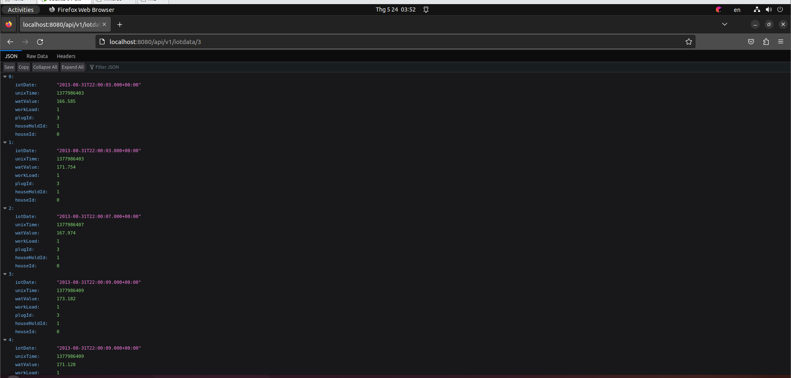
    </div>

- Kết quả linechart `plugId=3`
    <div align="center">
        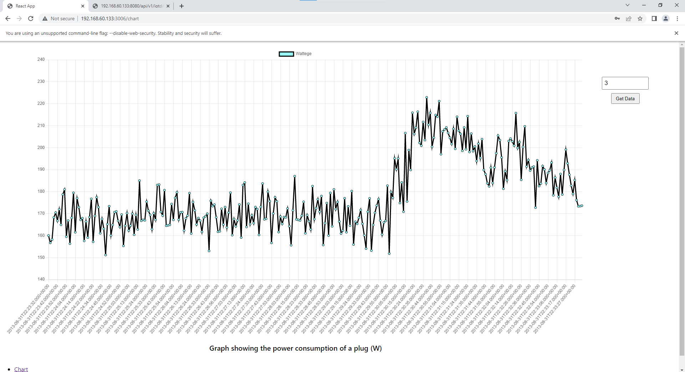
    </div>

### `Chương trình hiển thị thông tin điều khiển tại các cảm biến (được gửi từ gateway)`

1. Ý tưởng triển khai

Việc điều khiển thông tin các cảm biến sẽ được thực hiện ở frontend, vì vậy cần xây dựng method post để gửi thông tin cần bật censor cho gateway. Sau khi nhận được thông tin cần bật censor từ người dùng, gateway sẽ gửi 1 message theo một luồng riêng(`routingkey` là `IOTController`, `exchange` là `IOTController` ) tới node. Như vậy với mọi thông tin được gửi từ `IOTController` routingkey thì node sẽ coi như là thông tin điều khiển, việc này giúp phân biệt cho các bên phân biệt được giữa thông tin điều khiển và thông tin là dữ liệu. Node có vai trò nhận message và bật censor theo yêu cầu của người dùng.

2. Post method để bật censor

```java
    @PostMapping("/check")
    public void checkAndSend(@RequestBody Censor requestCensor) {
        // Retrieve entries from the database where status is "on" and have_turn_on is "no"
        Iterable<Censor> statusCensors = censorRepository.findByNameAndStatus(requestCensor.getName(), "on", "no");

        for (Censor censor : statusCensors) {
            int plugId = censor.getName(); // Assuming name field in Censor corresponds to plugId
            String msg = "Enable " + plugId;

            // Send message to IOTController
            iotData.convertAndSend("IOTController", "IOTController", msg);

            // Update have_turn_on field to "yes"
            censor.setHave_turn_on("yes");
            censorRepository.save(censor);
        }
    }
```

- Khi nhận post method gửi tới server gateway, gateway sẽ kiểm tra trong db có censor đó không. Nếu censor đó đang bật thì sẽ không bật lại và ngược lại nếu censor đó chưa được bật thì sẽ gửi message `"Enable " + plugId` tới node. Như vậy theo như phần 2 thì node sẽ gửi data theo đúng routingkey và queue theo đúng plugid chỉ định.

- Cuối cùng khi censor được bật thì `have_turn_on` của censor được chuyển thành `yes` để lần sau chương trình sẽ không phải bật lại censor.

3. Kết quả

- Thêm censor số 4
    <div align="center">
        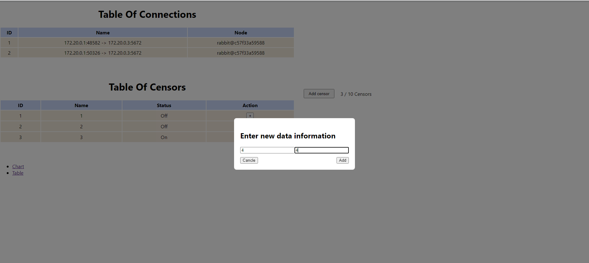
    </div>

- Trạng thái của censor 4 khi chưa bật là status `Off`
    <div align="center">
        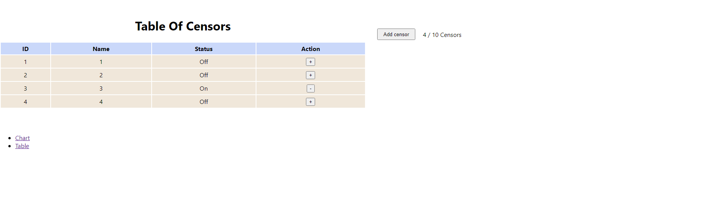
    </div>

- Tích vào dấu `+` ở ô action để bật Censor, khi đó status `On` tức là censor đã được bật
    <div align="center">
        
    </div>

- Kiểm tra chart của plug 4
    <div align="center">
        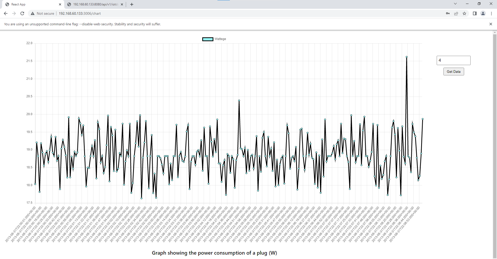
    </div>

### `Chương trình hiển thị đánh giá hiệu năng của giao thức: Throughput, delay, v.v. khi số lượng node cảm biến tăng lên.`

1. Mô tả chương trình

- Công nghệ:
  - `Prometheus`: Thu thập các metric từ node exporter
  - `Grafana`: Mô hình hóa các metric được gửi từ prometheus

- Để đánh giá hiệu năng của giao thức thì chúng em sử dụng plugin của rabbitmq tại broker đó là `rabbitmq_prometheus`. `rabbitmq_prometheus` đóng vai trò như một node exporter gửi các metric tới prometheus.

2. Chạy chương trình

- `RUN rabbitmq-plugins enable rabbitmq_prometheus` tại Dockerfile của `rabbitmq-broker`

- Cấu hình prometheus

```yml
# https://prometheus.io/docs/prometheus/latest/configuration/configuration/
global:
  # This is higher than RabbitMQ's collect_statistics_interval,
  # but still close enough to capture metrics that were refreshed within this interval
  # This value determines the range that we use with rate():
  # https://www.robustperception.io/what-range-should-i-use-with-rate
  scrape_interval: 15s # Default is every 1 minute.
  # scrape_timeout: 10s # Default is 10 seconds.
  # evaluation_interval: 60s # Default is every 1 minute.

# Alertmanager configuration
alerting:
  alertmanagers:
    - static_configs:
        - targets:
          # - 'alertmanager:9093'

# Load rules once and periodically evaluate them according to the global 'evaluation_interval'.
rule_files:
  # - "first_rules.yml"
  # - "second_rules.yml"

scrape_configs:
  # The job name is added as a label `job=<job_name>` to any timeseries scraped from this config.
  - job_name: "prometheus"
    static_configs:
      - targets: ["localhost:9090"]
  - job_name: "node-exporter"
    static_configs:
      - targets: ["node-exporter:9100"]
  - job_name: "rabbitmq-server"
    static_configs:
      - targets:
          - "localhost:9090"
          - "rabbitmq:15692"
          - "localhost:15692"
  - job_name: "rabbitmq-exporter"
    scrape_interval: 60s
    scrape_timeout: 59s
    static_configs:
      - targets:
          # docker-compose-dist-tls.yml
          - "rabbitmq-exporter:9090"

```

- Để lấy metric từ rabbitmq thì cần cấu hình

```yml
  - job_name: "rabbitmq-server"
    static_configs:
      - targets:
          - "localhost:9090"
          - "rabbitmq:15692"
          - "localhost:15692"
```

3. Kết quả

    Tất cả thông số ở hình ảnh bên dưới được đo khi chúng em bật 10 censor

- Hình ảnh đo throughput
    <div align="center">
        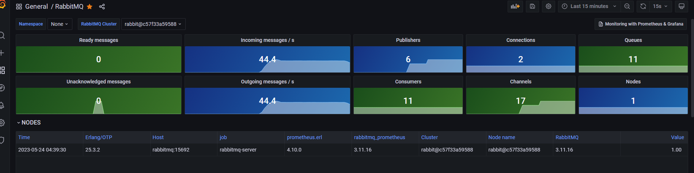
    </div>

- Hình ảnh đo dung lượng
    <div align="center">
        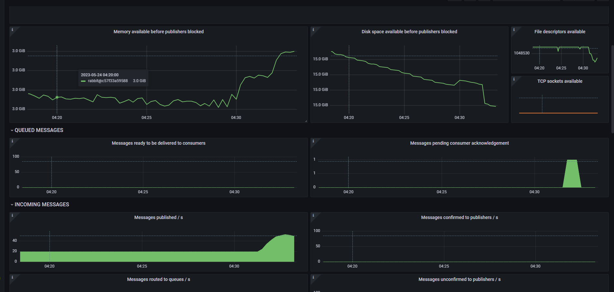
    </div>

- Hình ảnh đo lượng message được nhận
    <div align="center">
        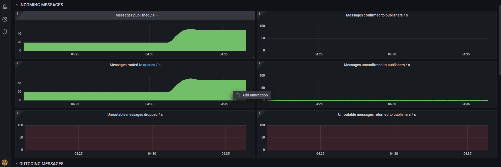
    </div>
- Hình ảnh đo lượng message gửi
    <div align="center">
        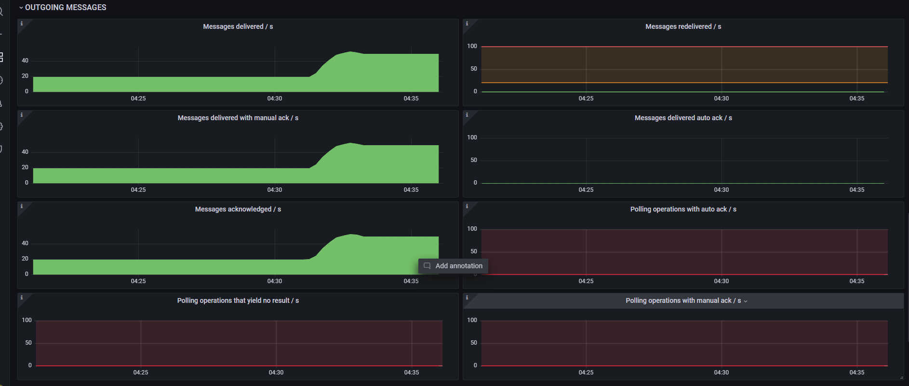
    </div>

    Đánh giá, để ý ở hình ảnh đo lượng message nhận và gửi thì không hề có 1 message nào bị drop hay bị unreceive tại queue, điều đó cho thấy rắng việc gửi tin nhắn từ node sang gateway không hề bị nghẽn hoặc gặp tình trạng delay.
### `Chương trình hiển thị đánh giá số lượng tối đa các node cảm biến có thể kết nối đến gateway`

1. Mô tả chương trình

- Tương tự chương trình đo throughput như trên chúng em cũng sử dụng prometheus và grafana để đánh giá số lượng tối đa các cảm biến có thể kết nối tới.

- Tuy nhiên, node exporter ở đây chúng em sử dụng là metric máy ảo sử dụng để chạy chương trình.

- Cấu hình máy ảo đang chạy chương trình là:
  - `Ram`: 8G
  - `Cpu`: 8 Cores
  - `Usage`: SSD 60GG

- Tiêu chí test:
  - Test dựa trên số node
  - Test dựa trên thời gian gửi 1 tin nhắn từ chương trình sinh dữ liệu

2. Test dựa trên số node với cấu hình mặc định

- Kết quả khi có 10 node
    <div align="center">
        
    </div>

- Kết quả khi có 5 node
    <div align="center">
        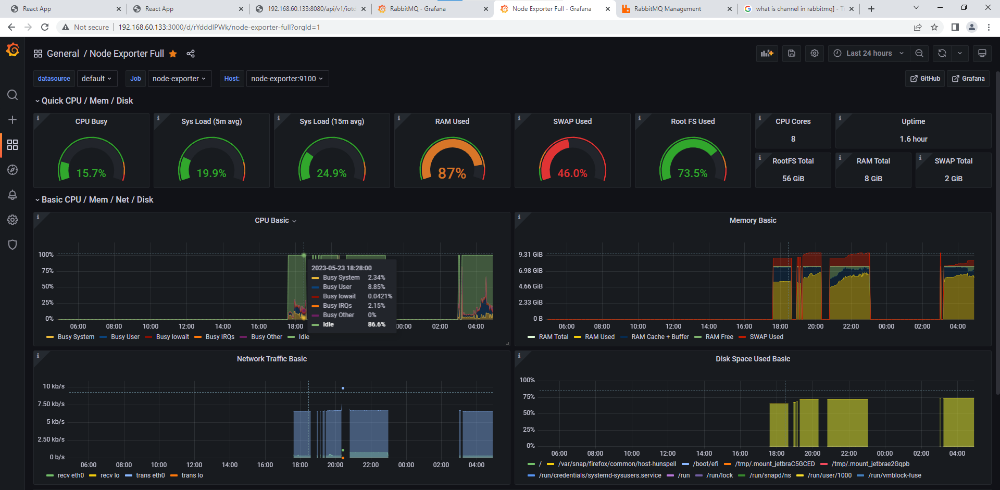
    </div>

- Kết quả khi có 1 node
    <div align="center">
        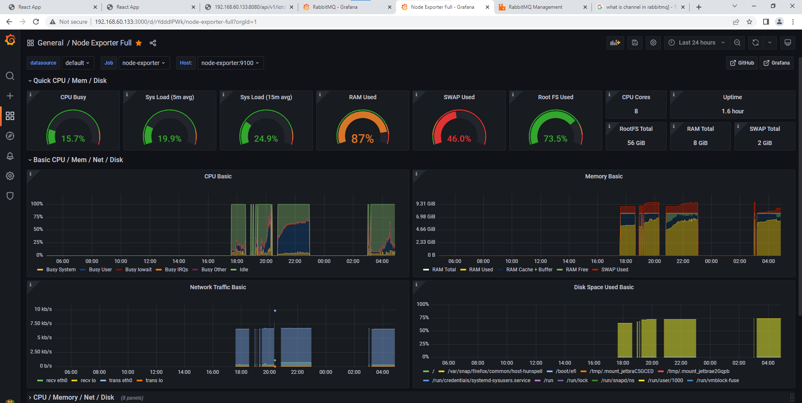
    </div>

- Kết luận:
  - Với 10 node chạy trên server với cấu hình trên thì không có gì thay đổi. Chứng tỏ rằng 10 node vẫn khá nhẹ đối với hệ thống, một phần lý do là cấu hình máy khá khỏe với 8GB ram và 8 Core. Còn khi test trên máy của các bạn khác với cấu hình khoảng 4GB ram và 2core thì không chạy được project. Vì vậy khi nhìn vào metric được đo thì với 10 node sẽ chạy hết công suất khi chạy trên cấu hình 6GB và CPU 2 core.

3. Test dựa trên số giây khi gửi 1 message từ chương trình sinh dữ liệu

- Data từng dòng sẽ được gửi không để delay
    <div align="center">
        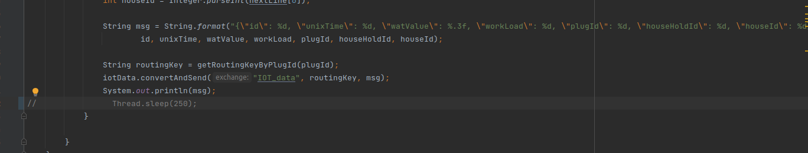
    </div>

- Kết quả khi không để độ trễ khi gửi từng dòng data
    <div align="center">
        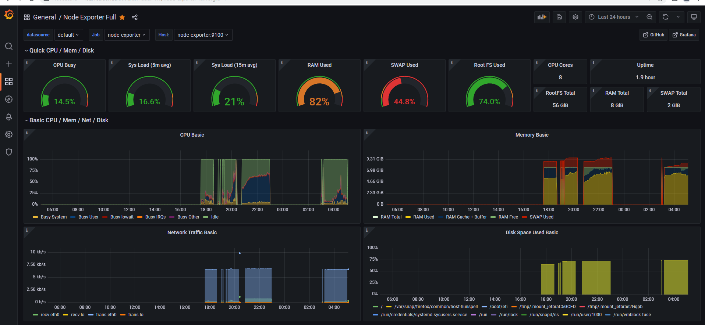
    </div>

- Kết quả khi để độ trễ gửi 1 message từ censor(0.25s)
    <div align="center">
        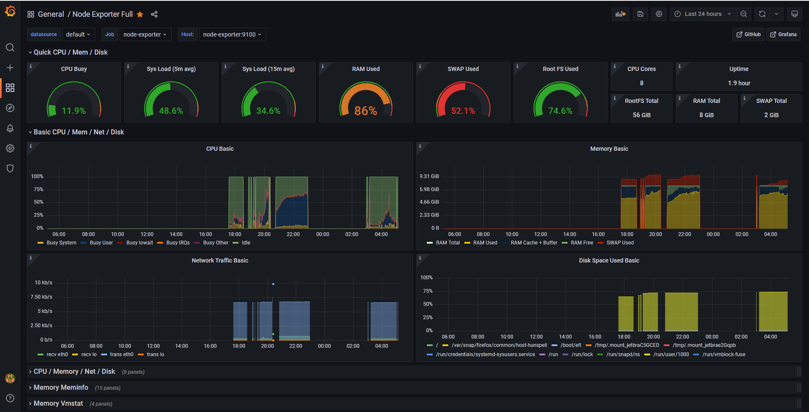
    </div>


- Kết luận:
  - Khi test từng độ trễ khi gửi 1 tin nhắn từ censor thì server vẫn không có nhiều thay đổi. Điều đó chứng tỏ rằng việc chia từng queue giúp cho gửi data không hề gặp delay và server cũng không hề gặp cao tải. 

## **Tài liệu tham khảo**

1. ### [RabbitMq broker](https://www.rabbitmq.com/tutorials/amqp-concepts.html)

1. ### [Spring AMQP](https://docs.spring.io/spring-amqp/reference/html/)

1. ### [AMQP monitoring](https://www.rabbitmq.com/prometheus.html)


